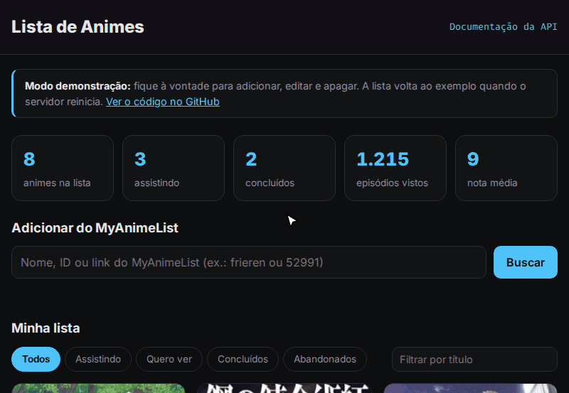
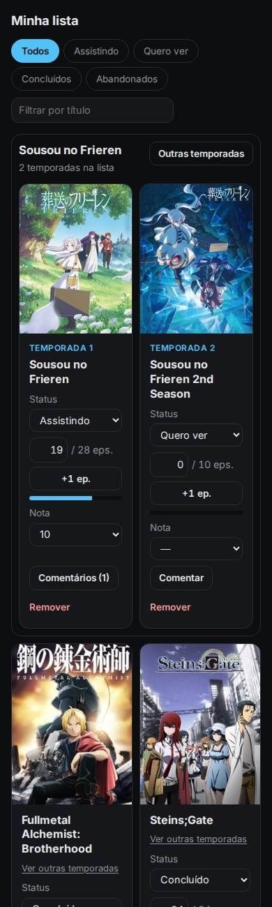

# Lista de Animes

[](https://github.com/Lakes777/lista-animes/actions/workflows/testes.yml)

API REST em Python com **FastAPI** para organizar sua lista de animes: o que você quer ver, o que está vendo e o que já viu. Os dados dos animes (título, episódios e capa) vêm da [Jikan](https://jikan.moe), uma API gratuita com o catálogo do **MyAnimeList**. A própria API também entrega um front em HTML, CSS e JavaScript puros.

### [Ver ao vivo](https://lista-animes-b8ql.onrender.com)

> Versão de demonstração no plano gratuito do Render: qualquer pessoa pode testar, e a lista volta ao exemplo quando o servidor reinicia. Depois de 15 minutos sem visitas o servidor dorme, e a primeira visita pode levar cerca de 1 minuto para carregar.

<p align="center">
  
</p>

## Funcionalidades

- **Adicionar do MyAnimeList:** busque pelo nome, pelo ID ou colando o link do anime. Título, número de episódios e capa são preenchidos sozinhos.
- **Acompanhar o progresso:** status (quero ver, assistindo, concluído, abandonado), episódios vistos com barra de progresso e nota de 1 a 10.
- **Escolher o episódio:** digite o número (ou use as setinhas), ou clique em **+1 ep.**. Ao começar, o anime passa para "assistindo". No último episódio, vira "concluído".
- **Temporadas juntas:** no MyAnimeList, cada temporada é um anime separado. Ao adicionar, a API vê na Jikan qual é a temporada anterior e a seguinte, e as temporadas da mesma franquia ficam num quadro só ("Temporada 1", "Temporada 2", "Filme"...). O botão **Outras temporadas** mostra as que faltam e adiciona com um clique.
- **Comentários:** cada anime tem um histórico de anotações com data, e cada uma pode dizer o episódio ("ep. 7: que luta!").
- **Filtros:** abas por status e busca por parte do título.
- **Estatísticas:** total de animes, quantos por status, episódios assistidos e nota média.
- **Documentação automática:** todas as rotas podem ser testadas no navegador em `/docs`.
- **Funciona no celular:** o layout se adapta a telas pequenas.

<p align="center">
  
</p>

## Rotas da API

| Método | Rota | O que faz |
|---|---|---|
| `GET` | `/animes?status=assistindo&busca=frier` | Lista a sua lista (filtros opcionais) |
| `POST` | `/animes` | Adiciona um anime informando os dados à mão |
| `POST` | `/animes/do-catalogo/{mal_id}` | Adiciona pelo ID do MyAnimeList, com os dados da Jikan |
| `GET` | `/animes/{id}` | Mostra um anime da lista |
| `PATCH` | `/animes/{id}` | Muda só os campos enviados (status, episódios, nota...) |
| `DELETE` | `/animes/{id}` | Tira da lista (e apaga os comentários dele) |
| `GET` | `/animes/{id}/outras-temporadas` | Temporadas da franquia que ainda não estão na lista |
| `GET` | `/animes/{id}/comentarios` | Comentários do anime, do mais novo para o mais antigo |
| `POST` | `/animes/{id}/comentarios` | Escreve um comentário (episódio opcional) |
| `DELETE` | `/animes/{id}/comentarios/{comentario_id}` | Apaga um comentário |
| `GET` | `/animes/estatisticas` | Resumo da lista |
| `GET` | `/catalogo/busca?q=frieren` | Procura animes no MyAnimeList |
| `GET` | `/catalogo/{mal_id}` | Detalhes de um anime: sinopse, gêneros, ano, nota no MAL |
| `GET` | `/saude` | Diz se a API está no ar |

As respostas usam os códigos HTTP certos para cada caso: **201** (criado), **204** (apagado), **404** (não existe), **409** (já está na lista), **422** (dados inválidos, ex.: nota 11 ou 30 episódios vistos de um total de 28) e **503** (o MyAnimeList está fora do ar).

## Instalação

Requer **Python 3.10+**.

```bash
git clone https://github.com/Lakes777/lista-animes.git
cd lista-animes
python -m venv .venv
source .venv/bin/activate
pip install -r requirements.txt
```

## Como usar

```bash
python -m lista_animes
```

Abra **http://127.0.0.1:8000** para usar a lista ou **http://127.0.0.1:8000/docs** para testar a API. Para desligar, aperte `Ctrl+C`.

A lista fica salva em `animes.db` (SQLite), na pasta de onde o comando foi rodado. Esse arquivo não vai para o Git. Para usar outro arquivo:

```bash
LISTA_ANIMES_BANCO=outra-lista.db python -m lista_animes
```

> **Dica:** a busca **por nome** da Jikan consulta o MyAnimeList na hora e às vezes fica fora do ar. A busca **por ID ou link** (ex.: `myanimelist.net/anime/52991`) usa uma cópia guardada pela Jikan e costuma funcionar mesmo assim.

## Publicação online

O arquivo [`render.yaml`](render.yaml) descreve o servidor para o [Render](https://render.com), e cada push na `main` publica a versão nova. Lá a API roda em **modo demonstração** (`LISTA_ANIMES_DEMO=1`):

- abre com uma lista de exemplo (`lista_animes/exemplos.json`) e um aviso no topo da página;
- aceita no máximo 100 animes, para ninguém encher o servidor (o limite é conferido antes de consultar a Jikan);
- o disco do plano gratuito é apagado quando o servidor reinicia, e a lista volta ao exemplo.

O endereço e a porta vêm das variáveis `HOST` e `PORT`. No PC, o padrão é `127.0.0.1:8000`, que só aceita conexões do próprio computador.

## Testes

```bash
pip install -r requirements-dev.txt
pytest
```

São 146 testes cobrindo as validações, o banco de dados, as rotas, o catálogo, as temporadas, os comentários e os arquivos do front. **Nenhum teste acessa a internet nem a sua lista real:**

- Cada teste usa um banco novo numa pasta temporária (`tmp_path`).
- A Jikan é substituída por uma imitação (`httpx.MockTransport`) que responde com respostas reais gravadas em `tests/dados/` (Frieren e as duas primeiras temporadas de Attack on Titan). Se o código tentar uma consulta que o teste não previu, o teste falha.

O GitHub Actions roda tudo a cada push, nas versões 3.10 a 3.14 do Python.

## Estrutura do projeto

```
lista-animes/
├── lista_animes/
│   ├── __main__.py    # ponto de entrada: escolhe o arquivo do banco e liga o servidor
│   ├── app.py         # cria a aplicação FastAPI e junta as peças
│   ├── rotas.py       # rotas de /animes e /catalogo
│   ├── modelos.py     # formato e validação dos dados (Pydantic)
│   ├── banco.py       # SQLite com SQL escrito à mão
│   ├── catalogo.py    # consultas à Jikan e tratamento de falhas
│   ├── exemplos.json  # lista de exemplo do modo demonstração
│   └── static/        # front: index.html, estilo.css e app.js
├── tests/             # testes com pytest (+ resposta real da Jikan em tests/dados)
├── docs/              # imagens do README
└── render.yaml        # configuração da publicação no Render
```

## Decisões técnicas

- **SQLite com SQL escrito à mão, sem ORM:** o `sqlite3` já vem com o Python, e escrever o `INSERT`, o `SELECT ... GROUP BY` e o `UPDATE` mostra o que acontece por baixo. Os valores sempre vão por marcadores (`:titulo`, `?`), nunca colados no texto do SQL. Isso protege contra **SQL injection**, e um teste salva o título `Robert'); DROP TABLE animes;--` para conferir.
- **`LIKE` com escape:** no SQL, `%` e `_` são curingas. Sem tratamento, buscar `_` traria a lista inteira. Esses caracteres são escapados e buscados como texto.
- **Validação no Pydantic, inclusive nas edições:** o `PATCH` junta o anime salvo com os campos enviados e valida o resultado inteiro. Assim a regra "episódios vistos ≤ total" vale mesmo quando só um dos dois muda.
- **Migração ao abrir o banco:** a validação do link da capa foi criada depois de já existirem dados salvos. Um item antigo com um link inválido derrubava a listagem inteira (erro 500). Agora, ao ligar, o servidor limpa esses links, e um teste simula um banco da versão antiga. Do mesmo jeito, bancos antigos ganham as colunas novas (`tipo`, `estreia`, `franquia`) com `ALTER TABLE`, e a data das temporadas antigas é buscada na Jikan quando elas entram numa franquia.
- **Temporadas por franquia:** cada anime guarda o número da sua franquia. Ao entrar, ele adota a franquia da temporada anterior ou da seguinte, se alguma já estiver na lista. Se ele for a peça que faltava entre duas (a 2ª temporada chegando depois da 1ª e da 3ª), as duas franquias viram uma só, tudo numa transação. A lista ordena as temporadas pela data de estreia.
- **Resistente ao MyAnimeList fora do ar:** os detalhes vêm do `/anime/{id}/full`, que traz as temporadas vizinhas na mesma consulta. Com o MyAnimeList fora do ar, a Jikan só responde o `/full` se tiver uma cópia guardada. Nesse caso a API usa o `/anime/{id}` simples, e o anime entra sem as temporadas ("não sei" é diferente de "não tem"). Quando o MyAnimeList volta, o botão **Outras temporadas** encontra a vizinha na lista e junta as duas.
- **Comentários apagados junto com o anime:** a tabela `comentarios` usa `ON DELETE CASCADE`. O SQLite só respeita isso com `PRAGMA foreign_keys = ON`, que precisa ser ligado em cada conexão, e um teste confere o arquivo do banco depois de remover o anime.
- **Falhas da Jikan viram mensagens claras:** erro 5xx, limite de consultas (429), demora (timeout), sem internet ou resposta em formato estranho viram um **503** com uma mensagem legível, em vez de um erro genérico. A Jikan foi escolhida por não pedir chave de acesso, então o projeto não tem nenhum segredo.
- **Banco e catálogo entregues à aplicação:** `criar_app(caminho_banco, catalogo)` recebe as duas dependências, e as rotas as pegam com `Depends`. Por isso os testes trocam o banco por um temporário e a Jikan por uma imitação, sem nenhum truque.
- **Front sem framework e sem XSS:** o front usa HTML, CSS e JavaScript puros, servidos pela própria API. É um servidor só, sem problema de CORS. Os textos que vêm da API entram na página com `textContent`, que não interpreta HTML, e um teste garante que o `app.js` nunca usa `innerHTML`.
- **Arredondamento da escola:** a nota média usa `Decimal` com `ROUND_HALF_UP` (8,25 vira 8,3). O `round()` do Python daria 8,2, porque arredonda o meio para o número par.
- **Testes que falham quando devem:** coloquei 12 bugs de propósito no código (tirar o escape do `LIKE`, desligar a migração, trocar o 409 por 500, usar `innerHTML`, entre outros) e rodei os testes contra cada um. Dois passaram despercebidos. Um não era um risco real: o `id` colado no SQL já chega validado como número. O outro era um buraco de verdade (remover um anime apagava todos) e virou um teste novo. Agora a suíte pega todos os 12.

## Próximos passos

- [x] Publicar online, com um link para abrir de qualquer lugar
- [ ] Contas de usuário, para cada pessoa ter a sua lista
- [ ] Ordenar a lista (por nota, título ou data)
- [ ] Guardar a sinopse e os gêneros e mostrar os detalhes ao clicar no cartão
- [ ] Exportar e importar a lista (JSON ou a partir do MyAnimeList)
- [ ] Se a busca por nome da Jikan falhar, tentar outra fonte (ex.: AniList)
